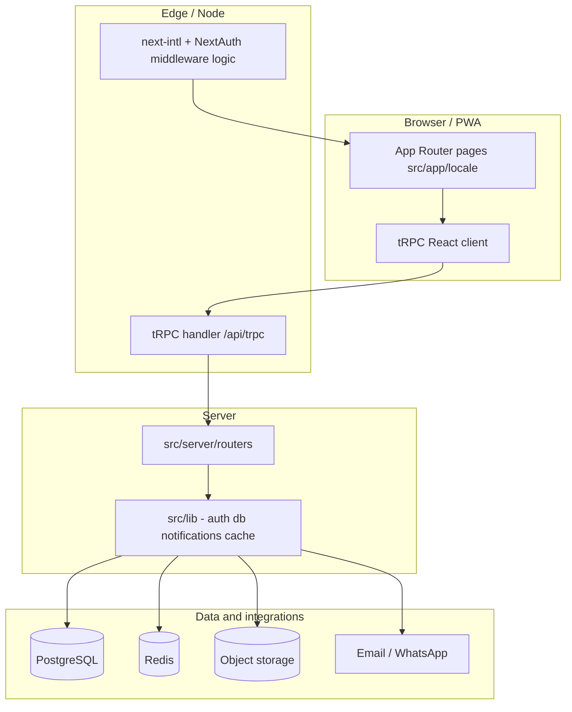

# Advanced guide — technical architecture (Nabra AI System)

This document maps **stack choices**, **runtime boundaries**, and **important code paths** so engineers can navigate the repo without spelunking every folder. It complements `docs/ADVANCED_BUSINESS.md` (domain) and the focused i18n guides under `docs/`.

---

## Stack overview

| Layer               | Technology                                                                                          |
| ------------------- | --------------------------------------------------------------------------------------------------- |
| Framework           | **Next.js 16** (App Router); dev server uses **port 3001** (`npm run dev`)                          |
| UI                  | **React 18**, **Tailwind CSS**, **Radix** primitives, **Framer Motion**, **Recharts**, **Swiper**   |
| API                 | **tRPC v11** + **TanStack Query**; **SuperJSON** for serialization                                  |
| Auth                | **NextAuth v4** (JWT sessions, **Credentials** provider), passwords via **bcrypt**                  |
| Data                | **PostgreSQL** via **Prisma** (`prisma/schema.prisma`)                                              |
| i18n                | **next-intl** — locales `en`, `ar`; routing in `src/i18n/routing.ts`; messages in `messages/*.json` |
| Validation          | **Zod** (shared client/server shapes in `src/lib/validations.ts` and routers)                       |
| Realtime / cache    | **Redis** (standard or **Upstash** — see `src/lib/cache.ts`)                                        |
| File storage        | **AWS S3** / **Backblaze B2** (image domains allowed in `next.config.js`)                           |
| PWA                 | **next-pwa** (disabled in development; see `next.config.js`)                                        |
| Testing             | **Jest** + Testing Library; **Playwright** for E2E                                                  |
| Docs / API explorer | **OpenAPI** surface (`trpc-openapi`, Swagger UI routes under `src/app/api/docs/`)                   |

---

## High-level architecture

---

## Repository layout (practical map)

| Path                                         | Role                                                                                                                                                                           |
| -------------------------------------------- | ------------------------------------------------------------------------------------------------------------------------------------------------------------------------------ |
| `src/app/`                                   | App Router: `layout.tsx`, `globals.css`, `api/**` route handlers                                                                                                               |
| `src/app/[locale]/`                          | Locale segment; dashboard groups `(auth)`, `(dashboard)` with `client/`, `provider/`, `admin/`                                                                                 |
| `src/server/trpc.ts`                         | tRPC initialization, **context** (`db`, `session`, `locale`, `req`), **procedures** (`public`, `protected`, `admin`, provider/client guards)                                   |
| `src/server/routers/`                        | Domain routers composed in `_app.ts` → `AppRouter`                                                                                                                             |
| `src/lib/db.ts`                              | Prisma client singleton                                                                                                                                                        |
| `src/lib/auth.ts`                            | `authOptions` for NextAuth                                                                                                                                                     |
| `src/lib/trpc/client.ts`                     | `createTRPCReact<AppRouter>()`                                                                                                                                                 |
| `src/components/providers/trpc-provider.tsx` | React Query + tRPC provider wiring                                                                                                                                             |
| `src/lib/error-handler.ts`                   | Sonner toasts + tRPC/Zod message mapping; optional `next-intl` `t`                                                                                                             |
| `src/lib/notifications/`                     | Email, WhatsApp, in-app, SSE helpers; **pass `locale`** from `ctx`                                                                                                             |
| `src/proxy.ts`                               | **Middleware implementation**: `next-intl` + `withAuth`, locale rewrite, **role-based redirects** for `client` / `provider` / `admin` segments (`export const config.matcher`) |

> **Note:** Next.js convention expects middleware at `middleware.ts` (project root or `src/`). This repository implements the same behavior in `src/proxy.ts`; ensure your deployment pipeline renames or re-exports it if your toolchain requires `middleware.ts`.

---

## Request path: tRPC

1. Client calls `trpc.*` hooks from `@/lib/trpc/client` (typed by `AppRouter`).
2. HTTP hits `src/app/api/trpc/[trpc]/route.ts` → `fetchRequestHandler` with `createTRPCContext`.
3. Context resolves **session** (NextAuth) and **locale** from cookies (`getLocaleFromCookie` in `src/server/trpc.ts`).
4. Routers use **Zod** inputs and throw **`TRPCError`**; `errorFormatter` attaches flattened **Zod** details for the client (`src/server/trpc.ts`).

---

## Internationalization

- **Routing**: `src/i18n/routing.ts` — use **`Link` / `redirect` / `useRouter` / `usePathname` from `@/i18n/routing`**, not raw `next/navigation`, for locale-aware URLs (`localePrefix: "as-needed"`).
- **Messages**: `messages/en.json`, `messages/ar.json`; loaded in `src/app/[locale]/layout.tsx` into `NextIntlClientProvider`.
- **RTL**: Locale layout sets `dir` for Arabic.
- **Server copy**: Notification helpers under `src/lib/notifications/` accept **`locale`**; tRPC **`ctx.locale`** (`src/server/trpc.ts`) should be passed through for parity with UI language.

---

## Background and scheduled work

- **`src/app/api/cron/check-subscriptions/route.ts`**: Intended to be triggered by an external scheduler (Vercel Cron, GitHub Actions, etc.); scans subscriptions for expiry notifications and related updates. Secure this route in production (secret header, IP allowlist, or platform-only invocation).

---

## Caching and performance

- `src/lib/cache.ts` — Redis key taxonomy (users, services, packages, subscriptions, requests, notifications). Invalidation helpers live alongside (`cache-invalidation.ts`, etc.).
- `src/lib/performance.ts` — project-specific performance utilities as needed.

---

## Quality gates (commands)

| Command              | Purpose                  |
| -------------------- | ------------------------ |
| `npm run lint`       | ESLint (Next)            |
| `npm run type-check` | `tsc --noEmit`           |
| `npm run test:ci`    | Jest in CI with coverage |
| `npm run test:e2e`   | Playwright               |

**Lint-staged** (on commit) runs ESLint, Prettier, and related Jest tests for touched files.

---

## Environment and secrets (non-exhaustive)

Typical categories inferred from code and dependencies:

- **Database**: `DATABASE_URL`, `DIRECT_URL` (Prisma)
- **Auth**: NextAuth `NEXTAUTH_SECRET`, `NEXTAUTH_URL`
- **Redis / Upstash**: as consumed in `src/lib/cache.ts`
- **S3 / B2**: upload and asset URLs (see `src/app/api/upload/` and image remote patterns in `next.config.js`)
- **Email / WhatsApp**: nodemailer and WhatsApp integrations under `src/lib/notifications/`

Treat this list as a **checklist**, not a complete `.env` template—verify each integration’s module for exact variable names.

---

## Related documents

- `docs/ADVANCED_BUSINESS.md` — domain and workflows
- `src/lib/error-handler.ts` — Sonner toasts and `errors.*` message keys
- `src/lib/notifications/` — multi-channel notifications and locale parameters
- `.cursor/rules/nabra-core.mdc` — concise agent-oriented project summary
